layout: true
  

`r paste0("
", params$event, " 

")` 

---

class: center, middle

Ces slides en ligne : `r paste0("http://datactivist.coop/", params$slug)`

Sources : `r paste0("https://github.com/datactivist/", params$slug)`

Les productions de Datactivist sont librement réutilisables selon les termes de la licence [Creative Commons 4.0 BY-SA](https://creativecommons.org/licenses/by-sa/4.0/legalcode.fr).

 
 

---
## Qui sommes-nous ?

    

### We .red[open data], we make them .red[useful]

---
## Qui sommes-nous ?

---
## Qui sommes-nous ?

- Datactivist est un .red[**pure player de l’open data**] créé en 2016, par Samuel Goëta et Joël Gombin.

- Se positionnant sur .red[**toutes les étapes du travail d’ouverture des données**], Datactivist travaille tant avec les producteurs de données qu’avec les réutilisateurs et participe à l’appropriation des données par chacun.

- Nous appliquons nos propres .red[**valeurs**] : nous sommes une coopérative ; nos supports de formation et nos contenus sont librement réutilisables, publiés en licence Creative Commons.

- Une approche issue de la recherche : voir notamment **https://datactivist.coop/these**. 

- Nous animons la communauté [#TeamOpenData](https://teamopendata.org).

---
## Nos activités

- Conseil sur les .red[**stratégies d’ouverture de données**] : nous aidons les organisations dans la conception et la mise en œuvre de leur stratégie d’ouverture de données.

- .red[**Accompagnement dans la réutilisation de données ouvertes**] : nous aidons les organisations à utiliser les données au quotidien. 

- .red[**Sensibilisation et formation à la donnée**] : nous formons à la culture générale des données, nous enseignons les grands principes et bonnes pratiques de l'open data et nous introduisons à la data science. 

- .red[**Médiation de données**] : nous organisons des hackathons, des open data camps, des expéditions de données...

???

La médiation de données est aussi fondamentalement une animation de communauté(s). 

---
class: inverse, center, middle

## Et vous, qui êtes-vous ?

---
## Objectifs de la journée
   

- Comprendre ce qu'est une donnée

- Appréhender la variété des types de données existantes

- Comprendre les "nouveaux habits des données" : data science, big data, open data

- Appréhender les enjeux attachés aux données personnelles

---
class: inverse, center, middle

# .red[Culture des données]
## Data, big data, open data…

---
class:middle, center
## Echauffement :
### 5 minutes, 20 données

Vous avez 5 minutes

Vous devez trouver 20 données dans notre environnement immédiat

Pas de recours aux écrans !

.footnote[[source](http://infolabs.io/5-minutes-20-donnees)]

---
class:center,inverse, middle
# Qu'est-ce 
# qu'une donnée ?

---
## Qu'est-ce qu'une donnée ?

> *Une donnée correspond à la représentation d'une information sous une forme conventionnelle destinée à faciliter son traitement*

.center[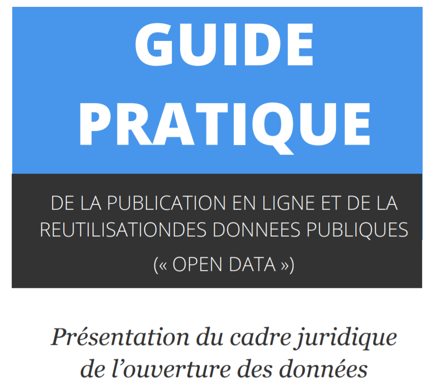] 

.footnote[[source](https://www.cnil.fr/sites/default/files/atoms/files/guide_open_data.pdf)]
---
## Le censeur à Rome, ancêtre de la statistique
.center[.reduite3[]]

.footnote[Source : *Asterix chez les pictes*, © Albert René 2013]
---
## Le censeur à Rome, ancêtre de la statistique
.center[.reduite3[]]

.footnote[*Asterix chez les pictes*, © Albert René 2013]
---
## La statistique : outil de gouvernement et de preuve
.pull-left[.middle[La statistique est à la fois :

  + **outil de gouvernement** (_Statistik_ - 18e siècle), et
  
  
  + **outil de preuve** (_statistics_ - 19e siècle)]]
.pull-right[.reduite2[]]
---
  
## [Quantifier, c'est convenir puis mesurer](http://www.pressesdesmines.com/media/extrait/PourSocioHistExtr.pdf)

.pull-left[
> Le verbe quantifier est employé ici dans un sens large : **exprimer et
faire exister sous une forme numérique ce qui, auparavant, était exprimé par
des mots et non par des nombres**.]

.pull-right[.reduite2[]]

---
## [Quantifier, c'est convenir puis mesurer](http://www.pressesdesmines.com/media/extrait/PourSocioHistExtr.pdf)

.center[.reduite3[]]

.footnote[*Asterix chez les pictes*, © Albert René 2013]

---
## Quantifier, c'est inscrire et figer une réalité sans cesse mouvante

.center[.reduite3[]]

.footnote[*Asterix chez les pictes*, © Albert René 2013]

---
class:inverse, middle, center
# Vers une définition des données

---
## Etymologie

### Latin : _dare_ (donner) > _datum_ (donné) > _data_ (donnés)
  
Ce qui est évident, va de soi, est accepté sans discussion

  

> From its first vernacular formulation, the existence of a datum has been independent of any
consideration of corresponding ontological truth. When a fact is proven false, it ceases
to be a fact. False data is data nonetheless.

.footnote[[Rosenberg, 2013](https://mitpress.mit.edu/books/raw-data-oxymoron)]

---

## Vers une définition

.pull-left[.reduite3[

⏺ enregistrabilité +🏗 briques de base ("*buildings blocks*")]]
.pull-right[
> *Data are commonly understood to be the raw material produced by **abstracting the world** into categories, measures and other representational forms – numbers, characters, symbols, images,sounds, electromagnetic waves, bits – that constitute the **building blocks** from which information and knowledge are created.*]

---
Class:
## La pyramide Data-Information-Knowledge-Wisdom

.pull-left[

]

.pull-right[Attribuée à [Russell Ackoff](http://en.wikipedia.org/wiki/Russell_L._Ackoff), 1989

Les données peuvent être des :

- faits
- signal/stimulis
- symboles]

---
Class:
## La pyramide Data-Information-Knowledge-Wisdom

- Les **.red[données]** sont la matière "brute" d'où naît l'information.

- **.red[L'information]** pourrait être définie comme des données qui ont été consignées,
classées, organisées, raccordées ou interprétées dans un cadre qui en dégage le sens

- En donnant du sens à de l'information, on obtient de la **.red[connaissance]**

- En donnant du sens à la **.red[connaissance]** on obtient du savoir

---
Class:
## La pyramide Data-Information-Knowledge-Wisdom

.center[]

_NB : le haut de la pyramide, est parfois remplacé par "compétence"_

---
class: inverse, center, middle

## La mise en données du monde

---
## "Datafication" : la mise en données du monde
> “L'immense gisement de données numériques découle de la capacité à paramétrer des aspects du monde et de la vie humaine qui n'avaient encore jamais été quantifiés. On peut qualifier ce processus de **« mise en données » (datafication)**. 

> […] “La mise en données désigne autre chose que la numérisation, laquelle consiste à traduire un contenu analogique - texte, film, photographie - en une séquence de 1 et de 0 lisible par un ordinateur. Elle se réfère à une action bien plus vaste, et aux implications encore insoupçonnées : **numériser non plus des documents, mais tous les aspects de la vie**.”

.footnote[[Kenneth Cukier, “Mise en données du monde, le déluge numérique”](https://www.monde-diplomatique.fr/2013/07/CUKIER/49318)]

---

## La "nombrification" du monde

.pull-left[.reduite[]]
.pull-right[
> La numérisation ne serait pas survenue sans une "nombrification" préalable qui consiste à quantifier de plus en plus d'aspects de notre expérience du réel.
> **Au commencement était le verbe, il semble à la fin que tout devient nombre.**
> Personne ne saurait parler sérieusement de l'état de la société et discuter politique sans se référer aux informations quantitatives.]

---
Class: middle, center

## La mise en données du monde

- **Concrètement, aujourd'hui, quels aspects de votre vie sont mis en données ?**

--

- Recherches internet, pratiques sportives, consommation énergie, régime alimentaire, trajets dans les transports en commun...

- Cette mise en donnée est rendue possible par le développement de .red[**capteurs**] qui viennent collecter et agréger ces données. **Avez-vous des exemples de capteurs ?**

--

- Recherches internet .red[(cookies)], pratiques sportives .red[(montres connectées)], consommation énergie .red[(compteurs connectés)], régime alimentaire .red[(appli type Yuka)], trajets dans les transports en commun .red[(Pass Navigo)]...

- La question devient peut-être, *quels aspects de votre vie ne sont pas (encore) mis en données ?*

---
## Le nouveau positivisme des données

> If you asked me to describe the rising philosophy of the day, I’d say it is **data-ism**. We now have the ability to gather huge amounts of data.This ability seems to carry with it certain cultural assumptions — **that everything that can be measured should be measured; that data is a transparent and reliable lens that allows us to filter out emotionalism and ideology**; that data will help us do remarkable things — like foretell the future.

David Brooks, éditorialiste du New York Times, ["The Philosophy of Data"](https://www.nytimes.com/2013/02/05/opinion/brooks-the-philosophy-of-data.html)

.center[]

---
## Le nouveau positivisme des données

- Attention, les données, même provenant de sources officielles, ne sont pour autant neutres, irréprochables ou porteuses de "LA" vérité

.center[]

- **Avez-vous des exemples de données officielles pouvant qui peuvent faire l'objet de critiques ?**
--

- Délinquance, immigration, SDF...

.footnote[© Scott Adams]

---
Class:

## Les données brutes sont un oxymore

.pull-left[
> Les données sont toujours "cuisinées" et jamais tout à fait "brutes"

> Les données ont besoin au préalable d'être imaginées comme données pour exister et fonctionner comme telles. L'imagination de ces données implique une base d'interprétation

]
.pull-right[

.footnote[© Xavier Gorce 2018]]

.footnote[[Source](https://mitpress.mit.edu/books/raw-data-oxymoron)]
---

## Data or capta ?

> Technically, then, what we understand as data are actually **capta** (derived from the Latin capere, meaning ‘to take’); those units of data that have been selected and harvested from the sum of all potential data.

[Kitchin, 2014](https://books.google.fr/books?hl=fr&lr=&id=GfOICwAAQBAJ&oi=fnd&pg=PP1&dq=kitchin+data+revolution&ots=pcyfMTZh-V&sig=dQyPTL3AIN_4RdWvtBFw4VjdAa4#v=onepage&q=kitchin%20data%20revolution&f=false)

.center[] 

---
class:center, middle, inverse
##Pause café : 15 minutes

---

## Données ou obtenues ? 

> Décidément, on ne devrait jamais parler de “données”, mais toujours d’ “obtenues”.

[Bruno Latour, 1993](http://www.bruno-latour.fr/fr/node/255)

.center[] 

---

class:center, middle, inverse
# Données, données... quelles données ?

---

## Données quantitatives
.pull-left[
Différents types de variables : 
- **Nominale** : des catégories que l’on nomme avec un nom (marié/célibataire/divorcé/veuf)

- **Ordinale** : échelle de mesure dotant chaque élément d'une valeur qui permet leur classement par ordre de grandeur (faible, moyen, fort)

- **Intervalles** : l’intervalle entre deux catégories a toujours la même valeur (12-16°C / 16-20°C / 20-24°C) 
]
.pull-right[

]

---

## Données qualitatives

.pull-left[
Non numérique => texte, image, vidéo, son, musique...

  + peuvent être converties en données quantitatives

  + risque de perdre la richesse des données originales
  
  + analyse qualitative de données
  
]
.pull-right[

]

---
## Exemple : les annotations en text mining

.reduite[]

---

## Données structurées

.pull-left[
Des données dotées d'un modèle qui définit les relations entre les composantes de la base de données

  + Ex : base de données relationnelle SQL
  
  + Lisibles machine
  
  + Faciles à analyser, manipuler, visualiser...
]
.pull-right[

]

---

## Données semi-structurées

.pull-left[
Pas de modèle prédéfini : structure irrégulière, implicite... mais données organisées néanmoins, ensemble raisonnable de champs

Exemple : XML, JSON

Possible de trier, ordonner et structurer les données
]
.pull-right[

]

---

## Données non structurées

.pull-left[Pas de structure commune identifiable
Exemple : BDD NoSQL

Généralement qualitatives

Difficilement combinées ou analysées quantitativement

Les données non structurées croitraient 15x plus que les données structurées
 
Machine learning de + en + capable d'analyser ces données.]

.pull-right[

]

---

## Données capturées, échappées, transitoires 

** Données capturées**

Observation, enquête, expérimentation, prise de notes, senseurs... => intention de générer des données

** Données échappées**

Sous-produit d'un engin ou d'un système dont la fonction première est autre
** Avez-vous des exemples de données échappées ?**
--

Parking, borne d'accès...

** Données transitoires**

Echappées qui ne sont jamais examinées, transformées ou analysées

---
## Données dérivées

Résultat d'un traitement ou une analyse supplémentaire de données capturées. 

Exemple avec les [données de Google Maps](https://www.justinobeirne.com/google-maps-moat) : 

---

##Index, attributs, métadonnées

**Index**

Des données permettent l'identification et la mise en relation. Essentielles pour enrichir les données. Exemple : SIRET. 

**Attributs**

Des données représentent les aspects d'un phénomène, mais ne sont pas des index (pas identifiants uniques).

**Métadonnées**

Des données sur les données. Peuvent être descriptives, structurelles ou administratives. Exemple de standard : le [Dublin Core](https://fr.wikipedia.org/wiki/Dublin_Core). 

---

## Les données crowdsourcées

Des données produites par des citoyens, des communs partagés et gouvernés par leurs producteurs

**Connaissez-vous un site ou une application fonctionnant via des données crowdsourcées ?**

--

.pull-left[Exemple : OpenStreetMap, le wiki de la carte]

.pull-right[
.reduite[]
]

---
## Exemple : OpenStreetMap

.center[] 

---
class:inverse, middle, center
# De l'open data au big data

---
## Open data : quelques jalons historiques

---

## 07 Décembre 2007 : la rencontre de Sebastopol 

.pull-left[
👥 **Quoi ?** Une rencontre de l'Open Governement Group à Sebastopol (Californie), siège des éditions O'Reilly

🎯 **Pourquoi ?** : Influencer le futur président des Etats Unis pour faire avancer l'open data

📜 **Comment ?** En adoptant une déclaration définissant les grands principes de l'Open Government Data 

]
.pull-right[
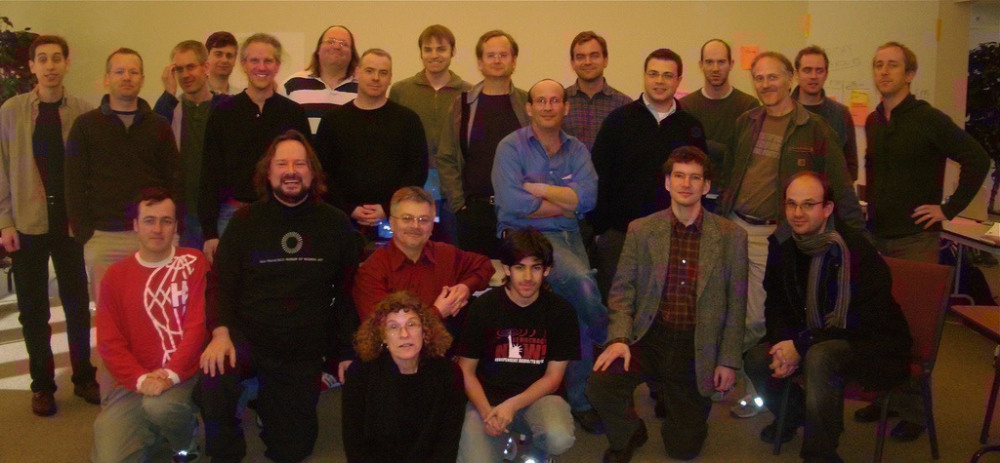
]

---
class:middle, center

# Revue des principes

---
class: middle, center

# 1. Des données complètes
### Toutes les données publiques doivent être rendues disponibles dans les limites légales liées à la vie privée ou la sécurité
---
class: center, middle
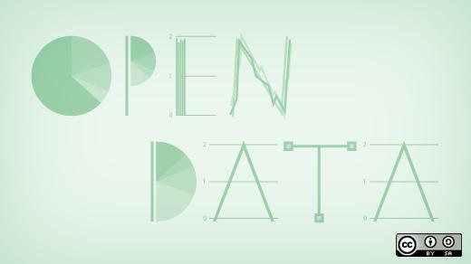
# BY DEFAULT
---
class: middle, center

# 2. Des données primaires
###  Les données ouvertes sont telles que collectées à la source, non-agrégées avec le plus haut niveau de granularité

---
class: middle, center

# 3. Des données fraiches (*timely*)
### Les données doivent être disponibles dès qu'elles sont produites

---
class: middle, center

# 4. Des données accessibles 
### Les données doivent être utilisables par le plus grand nombre d’usagers potentiels

---
class: middle, center

# 5. Des données exploitables par les machines 
###  Les données peuvent être traitées automatiquement par les machines

---
class: middle, center

# 6.Des données non discriminatoires 
### Elles peuvent être utilisées par tous sans réclamer un enregistrement préalable
---
class: middle, center

# 7. Des données dans un format ouvert
### Ce format ne doit pas être la propriété d'une organisation en particulier (.xls) et doit être gouvernée par ses usagers

---
class: middle, center

# 8. Des données dans une licence ouverte
### Idéalement dans le domaine public sinon dans une licence conforme à l'[Open Definition](www.opendefinition.org) : Licence Ouverte (CC-BY) ou ODBL (CC-BY-SA)

---
## OGP : gouvernement ouvert

.center[]

---
## Démocratie ouverte

.center[.reduite[]]

---
class:inverse, middle, center
# L'open data dans la pratique

---

## Défi 1 : la découvrabilité des données

.pull-left[
> Data findability is a major challenge. We have data portals and registries, but government agencies under one national government still publish data in different ways and different locations.(…)
**Data findability is a prerequisite for open data to fulfill its potential and currently most data is very hard to find.** 
]

.pull-right[

.footnote[https://index.okfn.org/insights/]
]

---
class:middle, center
 

---

## Défi 2 : le problème de la qualité

.pull-left[
>**Government data is usually incomplete, out of date, of low quality, and fragmented.** In most cases, open data catalogues or portals are manually fed as the result of informal data management approaches. **Procedures, timelines, and responsibilities are frequently unclear among government institutions tasked with this work.**

]
.pull-right[
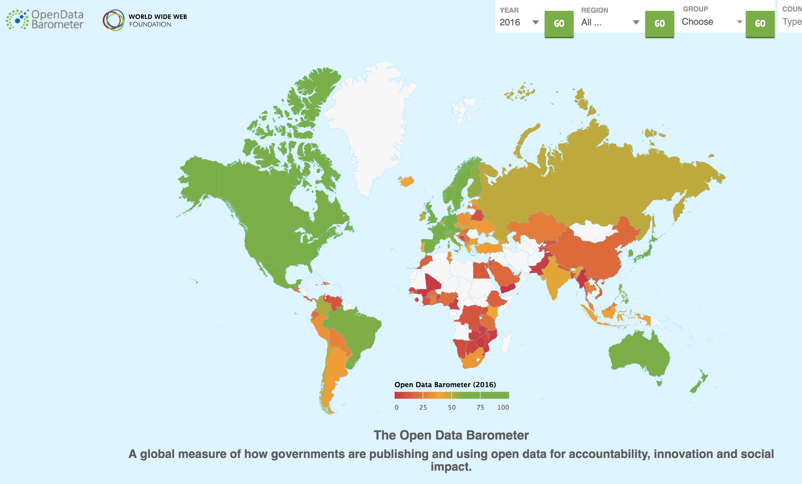

.footnote[http://opendatabarometer.org/4thedition/report/]
]

---
## Le recensement des données ouvertes localement

> La moitié des descriptions des jeux de données fait moins de 180 caractères (soit un peu moins de la longueur d’un tweet)
4% des jeux de données ont une description supérieure à 1000 caractères soit moins d’une demi-page

.center[.reduite[]]

.footnote[[Source](https://medium.com/datactivist/qui-a-ouvert-quoi-le-recensement-des-donn%C3%A9es-des-villes-est-maintenant-ouvert-b7f697135c1f)]

---
## Le recensement des données ouvertes localement

.center[] 

.footnote[[Source](https://medium.com/datactivist/qui-a-ouvert-quoi-le-recensement-des-donn%C3%A9es-des-villes-est-maintenant-ouvert-b7f697135c1f)]

---
## Data.gouv.fr ?

Plateforme nationale Open Data créée par la mission Etalab

.center[.reduite[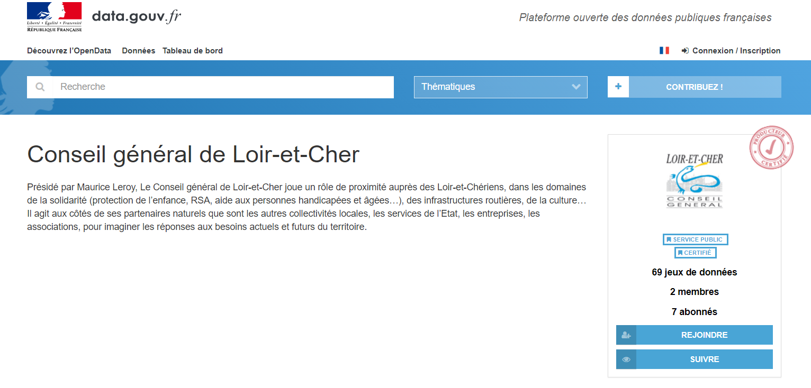]]

---
## Data.gouv.fr ?

.center[.reduite[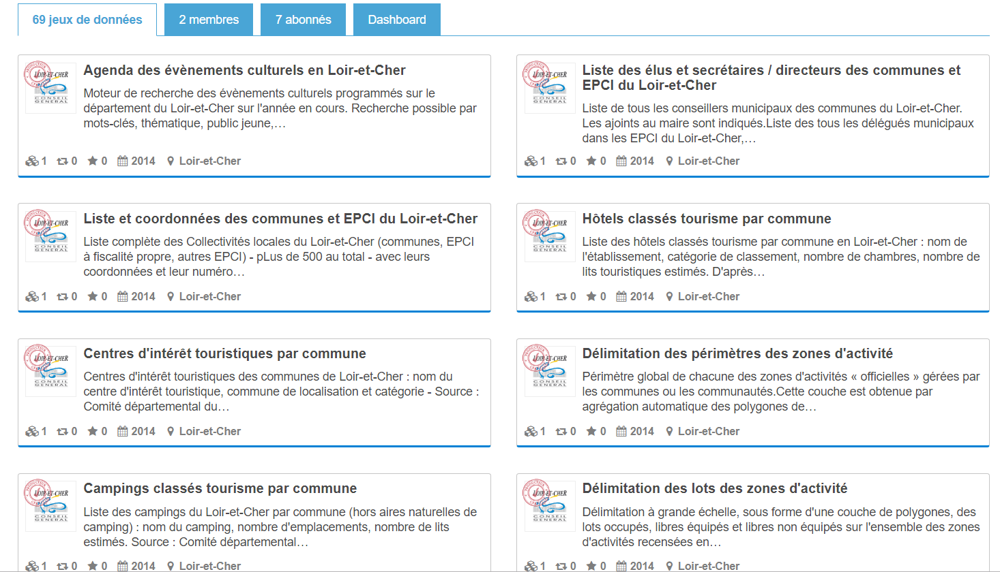]]

---
## Exemple de données ouvertes: la base SIRENE

.center[.reduite2[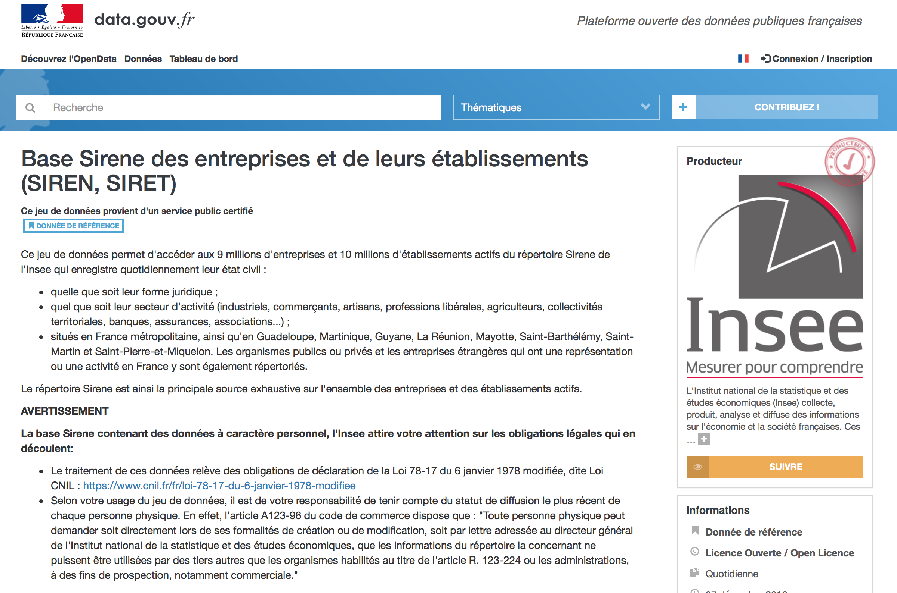]]

---

class:inverse, middle, center
## Connaissez-vous d'autres plateformes open data que data.gouv.fr ?

## Quels jeux de données utilisez-vous ?

---

## La base SIRENE : exemple de cas d'utilisation

.reduite[.center[]]
---
##Exemple de données ouvertes : la base adresses
.reduite[.center[]]

---
##Exemple de données ouvertes : les accidents de la route
.reduite[.center[]]

---

## Les accidents de la route
.reduite2[.center[]]
.footnote[Plus d'accidents sur l'A8 mais surtout plus de véhicules…]

---

## Les accidents de la route

.reduite2[.center[]]
.footnote[[Carte par Joël Gombin dans Marsactu](https://joelgombin.github.io/marsactu_accidents/chronique.html)]

---

## Exemple de données ouvertes : les inspections des restaurants

.reduite2[.center[]]
.footnote[[Résultats des contrôles officiels sanitaires : dispositif d'information « Alim’confiance »](https://www.data.gouv.fr/fr/datasets/resultats-des-controles-officiels-sanitaires-dispositif-dinformation-alimconfiance/)]

---

## Les inspections des restaurants

.reduite2[.center[]]
.footnote[[26 établissements au niveau d'hygiène à corriger de manière urgent ](https://dgal.opendatasoft.com/explore/embed/dataset/export_alimconfiance/map/?disjunctive.app_libelle_activite_etablissement&disjunctive.filtre&refine.synthese_eval_sanit=A%20corriger%20de%20mani%C3%A8re%20urgente&location=6,47.24195,5.00977&static=false&datasetcard=true)]

---
class: inverse, center, middle

## Données et usages

---
## Ouvrir des données à tout prix ?

.center[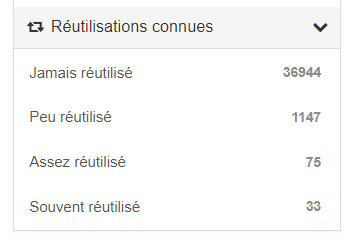]

.center[*Nombre de réutilisations connues sur data.gouv.fr (février 2019)*]

Or ouvrir des données représente un **coût** pour les organismes publics

Pour les convaincre de continuer, il s'agit de .red[**montrer le potentiel et la valeur de ces données**], notamment en repartant des .red[**utilisateurs**] et de leurs .red[**usages**]

---
Class: middle, center

## Partir de la demande

- Dans un premier temps, il s'agit de bien comprendre les usagers possibles des données publiques. 

- Cela peut passer par une cartographie des besoins des utilisateurs en définissant des **personas**. Ex ici avec la ville de New-York

.center[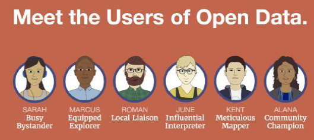]

- Dans un deuxième temps, il faut mettre en place des .red[mécanismes d'échange] entre administrations et utilisateurs (fonctionnalité de commentaires et de discussions)

---
Class: middle, center

## DODOData

.center[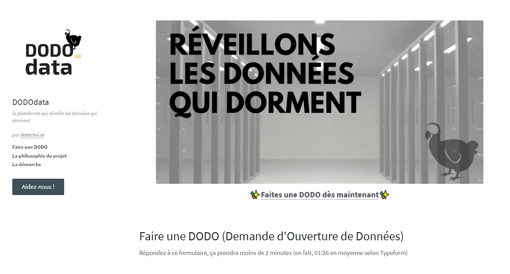]

.footnote[[Dododata](https://www.dododata.io/)]
---
Class: middle, center

## Challenge data : croiser données et usages !

Vous allés être confrontés à des challenges où il s'agit de

- **Valoriser des données existantes**

- **Déterminer des usages possibles** à des données ouvertes

- **Concevoir des services** utilisant des données ouvertes

- **Comprendre les besoins réels d'usagers** pour ouvrir des données

- **Concevoir un modèle économique** se basant sur des données ouvertes

- **Trouver d'autres données ouvertes** pour les croiser et enrichir des données internes

.footnote[[Article Medium Challenge Data](https://medium.com/datactivist/challenge-data-une-semaine-%C3%A0-sciences-po-saint-germain-pour-concevoir-des-usages-autour-de-d7c71548f73e)]

---
Class: middle, center

## Challenge data : croiser données et usages !

Données et usages font bon ménage... A vous de réveiller le potentiel de ces données !

.center[]

---
class:inverse, middle, center
## A vous de jouer !

---
## Vos propres données

+ Quels jeux de données pourriez-vous ouvrir ? Listez-en 2 ou 3 maximum

+ Pour quels utilisateurs ? Définissez vos personas

+ Possibles contraintes ?

+ Quelle priorité ?

Vous avez 10 minutes !

---
class:inverse, middle, center
# Big data

---

## Les 4 V du Big data

---

## L'obsession du volume de données

.pull-left[
**Quelques chiffres omniprésents** : 
- le volume de données produit double tous les 3 ans (Gantz & Reisel 2011)
- 90% des données créées dans les deux dernières années (IBM 2012)
- 40% : croissance annuelle de la production de données (Maniyka et al. 2011) 
]
.pull-right[
**Problèmes de cette approche** : 
- Estimations guidées par des intérêts commerciaux
- Ne définit pas ce que sont ces données
- Résume le big data au Volume
-Explique mal la mise en données du monde

]

---

## Les promesses du big data

** Selon vous, quels sont les intérêts du big data ?**

--

Kitchin (2014) résume les promesses du big data : 
- **“Governing people”** : dans la continuité de la statistique, améliorer la connaissance de l’administration et prédire les crimes

- **“Managing organisations”** : améliorer le fonctionnement de toutes les composantes de l’organisation par l’exploitation des données

- **“Leveraging value and producing capital”** : micro-ciblage marketing, optimisation des magasins et des opérations, efficience de la chaine

- **“Creating Better places”** : gouverner les villes avec des données (smart city) 

- **Un nouveau paradigme scientifique** : une nouvelle ère guidée par les corrélations

---

## Linked data

- poussé par le W3C et Tim Berners-Lee
- sémantique / web des données
- S'appuyer sur des formats ouverts : RDF / SPARQL
- wikidata => http://projetjourdain.org/network/index.htm

.center[]

---

## API

.pull-left[
- Application programming interface => un programme vu de la surface

- les machines parlent aux machines

- donnée dynamique => ouverture potentiellement limitée et contrôlée 

- un exemple : [overpass turbo](https://overpass-turbo.eu/)]
.pull-right[

]

---
class:center, middle, inverse
##Pause café : 10 minutes

---
class:inverse, middle, center
## Qu'est-ce que la data science ?

---
class:middle

## Au commencement était la statistique

- une vieille science (18e siècle), pour aider les États (_Statistik_) mais aussi des entreprises privées (au départ, les assureurs => actuariat)

- fondée sur les probabilités

- faite par des mathématiciens

- forte dimension théorique

---
class:middle
## Data science : les nouvelles statistiques ?

> I keep saying the sexy job in the next ten years will be statisticians. People think I’m joking, but who would’ve guessed that computer engineers would’ve been the sexy job of the 1990s?

Hal Varian (Chief economist, Google), The McKinsey Quarterly, January 2009

> “I think data-scientist is a sexed up term for a statistician”

[Nate Silver](http://www.statisticsviews.com/details/feature/5133141/Nate-Silver-What-I-need-from-statisticians.html)
---

## Data science is the new statistics?

.center[.reduite[]]

---
## Développement de la puissance de calcul

---
## Développement de la capacité de stockage

---
## Développement de la capacité de stockage

.center[]

---
Class: middle
## Que fait-on une fois qu'on a des données ?

### Modélisation

- Un modèle réduit de la réalité pour analyser, expliquer ou prédire

Modéliser, c’est mettre en relation une *variable expliquée*
(dépendante / prédite) et une ou plusieurs *variables explicatives*
(indépendantes / prédicteurs).

---
## Pourquoi modéliser ?

.reduite[.center[]]

---
## Pourquoi modéliser ? Les ["deux cultures"](https://projecteuclid.org/download/pdf_1/euclid.ss/1009213726)

- pour analyser et expliquer

- pour prédire

---
## Pourquoi modéliser ? Les ["deux cultures"](https://projecteuclid.org/download/pdf_1/euclid.ss/1009213726)

- pour analyser et expliquer (**statistiques classiques, économétrie**)

- pour prédire (**machine learning, IA...**)

### All models are wrong, some are useful

> Since all models are wrong the scientist cannot obtain a "correct" one by excessive elaboration. On the contrary following William of Occam he should seek an economical description of natural phenomena. 

[George Box](https://dx.doi.org/10.1080%2F01621459.1976.10480949)

---
## Et le machine learning alors ?

- Fondamentalement, modélisation et machine learning ne sont pas différents, du point de vue d'un statisticien : modéliser un $Y$ en fonction d'un vecteur de $X_i$

- une des différences principales toutefois : veut-on prévoir ou comprendre/analyser ?

- en pratique : machine learning porte sur des données plus complexes que la modélisation traditionnelle

- Souvent beaucoup de valeurs manquantes 

---
## Concepts de machine learning

- Apprentissage supervisé vs non supervisé 

- Apprentissage supervisé : il faut des données déjà classées/étalonnées. Souvent à la main ! => *#digitallabour*

---
## Apprentissage supervisé 

[.reduite[.center[]]](https://fakecaptcha.com)

---
## Apprentissage supervisé

[.reduite[.center[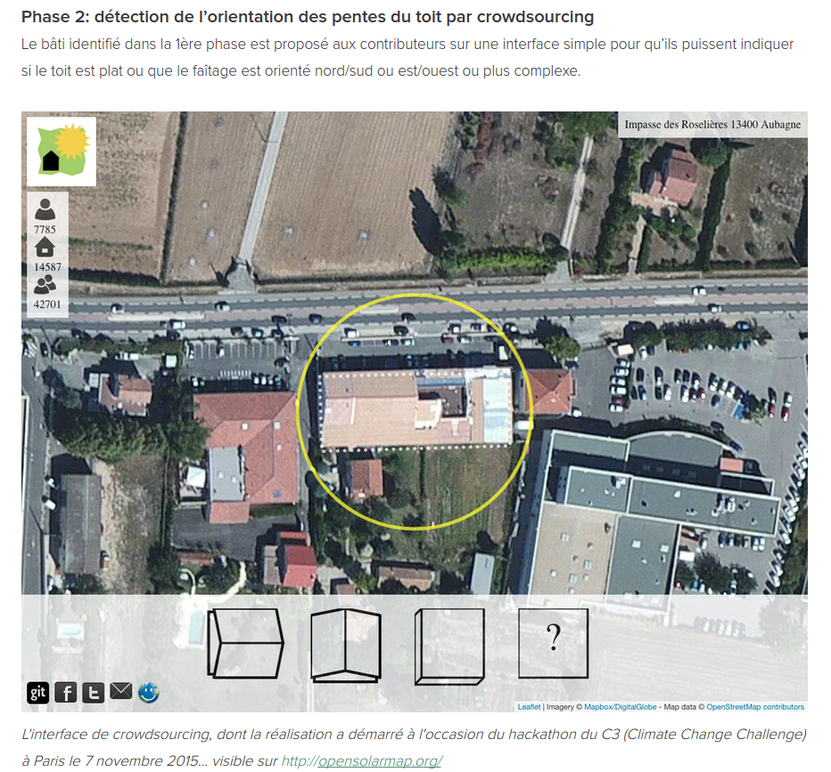]]](https://cquest.hackpad.com/OpenSolarMap-9oMiYswLksF)

---
class: center, middle, inverse

# Le data pipeline

---

## Le pipeline de données

---
## Vérifier les données

---
## Nettoyer les données

Paradigme du [_tidy data_](http://vita.had.co.nz/papers/tidy-data.pdf) (Hadley Wickham)

> “Happy families are all alike; every unhappy family is unhappy in its own way.” – Leon Tolstoï 

> “Tidy datasets are all alike, but every messy dataset is messy in its own way.” – Hadley Wickham

**Principes du *tidy data* **
- chaque variable correspond à une colonne
- chaque observation/individu correspond à une ligne
- chaque type d'unité d'observation correspond à une table
- chaque cellule comporte une donnée 

---
# Visualiser les données
### Choisir un format de visualisation
.center[.reduite[]]

---
# Visualiser les données
### Trouver un outil
.reduite[]

---
class:inverse, middle, center
# Cadre juridique et protection de la vie privée

### Focus sur le RGPD

---

## Répondre à la faiblesse du cadre juridique antérieur

.center[]

---
## Le RGPD ? 

**Règlement Général de Protection des Données** : adopté à la mi-avril 2016 après 4 années de débat, entré en vigueur le 25 mai 2018, il renforce considérablement le droit européen de protection des données personelles.

3 objectifs : 
- Renforcer les droits des personnes

- Responsabiliser les acteurs traitant des données personnelles

- Crédibiliser la régulation

Le RGPD propose un **cadre unifié pour l'ensemble de l'UE** qui s'applique à chaque fois qu'un résident européen est visé par un traitement de données personnelles. 

---

## Renforcer les droits des personnes

.pull-left[

**Droit à la portabilité des données** : Droit de recevoir ses données "dans un format structuré, couramment utilisé et lisible par machine" et de les transmettre à un autre service si possible de matière automatisée.]
.pull-right[

**Transparence et consentement explicite** : plus de lisibilité sur ce qui est fait de mes données (preuve de consentement explicite dans des termes clairs) et j’exerce mes droits plus facilement (droit d’accès, droit de rectification, droit à l'oubli).
]

---

## Exemple de demande de consentement explicite

.center[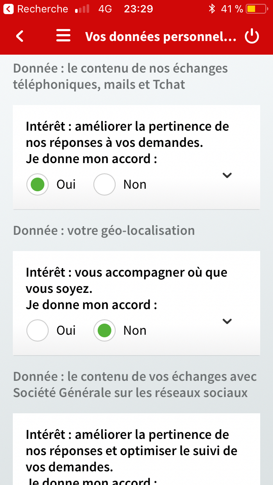]

---

## Renforcer les droits des personnes

.pull-left[

**Protection des mineurs** : Les services en ligne doivent obtenir le consentement des parents des mineurs de moins de 16 ans avant leur inscription.

]
.pull-right[

**Guichet unique** : En cas de problème, je m’adresse à l’autorité de protection des données de mon pays, quelque soit le lieu d’implantation de l’entreprise qui traite mes données.
]
.footnote[Source : [CNIL](https://www.cnil.fr/fr/plus-de-droits-pour-vos-donnees)]

---

## Renforcer les droits des personnes

.pull-left[

**Sanctions renforcées** : En cas de violation de mes droits, l’entreprise responsable encourt une sanction pouvant s’élever à 4% de son chiffre d’affaires mondial.

]
.pull-right[

**Droit à l'oubli** : Je peux demander à ce qu’un lien soit déréférencé d’un moteur de recherche ou qu’une information soit supprimée s’ils portent atteinte à ma vie privée.
]
.footnote[Source : [CNIL](https://www.cnil.fr/fr/plus-de-droits-pour-vos-donnees)]

---

## Responsabiliser les acteurs

- **Privacy by design** : protection des données personnelles dès la conception du produit et par défaut

- **Minimisation** : limiter la quantité de données personnelles dès le départ

- **Accountability** : mettre en place des mesures de protection des données et démontrer cette conformité à tout moment

- Fin des obligations déclaratives sauf si risque accru pour la vie privée

---

## Les 6 étapes de la mise en conformité

.pull-left[

ℹ DPO obligatoire uniquement pour secteur public et entreprises dont le traitement de données sensibles à grande échelle est une activité principale. 
]

.pull-right[
1. **Désigner un pilote** : Délégué à la Protection des Données (Data Protection Officer) exerce une mission d’information, de conseil et de contrôle en interne. 
2. **Cartographier** : élaboration d'un registre des traitements des données personelles
3. **Prioriser** : sur la base du registre, identifiez les actions à mener en priorité pour se conformer aux obligations actuelles et à venir. 
]

---

## Les 6 étapes de la mise en conformité

4.**Gérer les risques** : Si identification de risques élevés, mener pour chaque traitement concerné une analyse d'impact sur la protection des données (PIA). 

5.**S'organiser** : mise en place de procédures pour l’ensemble des événements qui peuvent survenir au cours de la vie d’un traitement (ex : faille de sécurité, demande de rectification, changement de prestataire…)

6.**Documenter** :  prouver votre conformité au règlement, constituer et regrouper la documentation nécessaire qui doit être réexaminée régulièrement.

---

## Crédibiliser la régulation

⚖️ Les autorités de protection peuvent notamment : limiter temporairement ou définitivement un traitement, suspendre les flux de données, ordonner la rectification, la limitation ou l'effacement des données…

🔫 Amendes : jusqu'à 10 ou 20 millions d’euros, ou, dans le cas d’une entreprise, de **2% jusqu’à 4% du  chiffre d'affaires annuel mondial**, le montant le plus élevé étant retenu.

🇪🇺
Sanction sera **conjointement adoptée entre l’ensemble des autorités concernées**, donc potentiellement pour le territoire de toute l’Union européenne.

---
class: inverse, center, middle

# Merci !

Contact : [timothee@datactivi.st](mailto:timothee@datactivi.st)